# ClassPush 云端版使用教程 (小白必看) ☁️

欢迎使用 ClassPush 云端版！
不需要一直开着电脑，只需要简单的 3 步设置，GitHub 就会每天准时把课表推送到你的 WxPusher App 上。

> **注意**：你需要下载 **WxPusher** App 才能接收消息哦 (因为微信官方限制，Wxusher公众号关闭了接收消息的服务)。虽然要多下个 App，但好处是推送超级稳定，而且完全免费！

---

## 第一步：复制项目 (Fork)

1.  注册并登录 GitHub 账号 (如果没有的话)。
2.  点击本页面右上角的 **Fork** 按钮。
    > 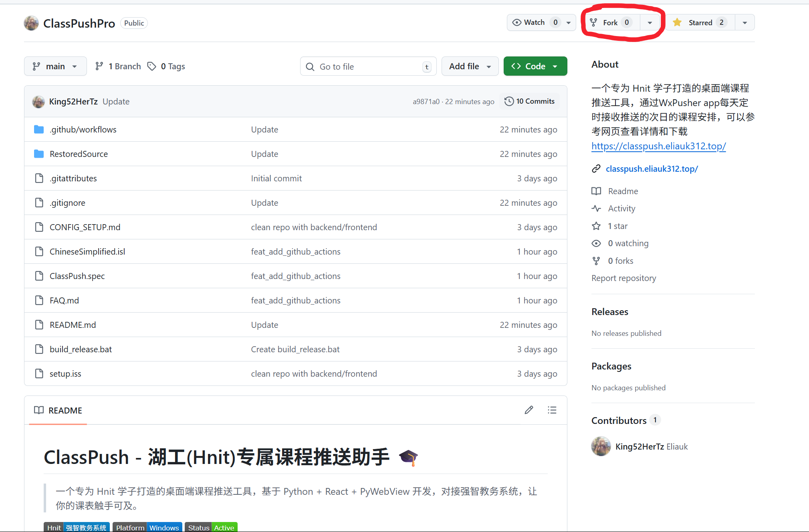

3.  点击底部的 **Create fork** 绿色按钮。
    > 这一步相当于把这个软件“复制”了一份到你自己的账号下，以后它就是你的了。
    > 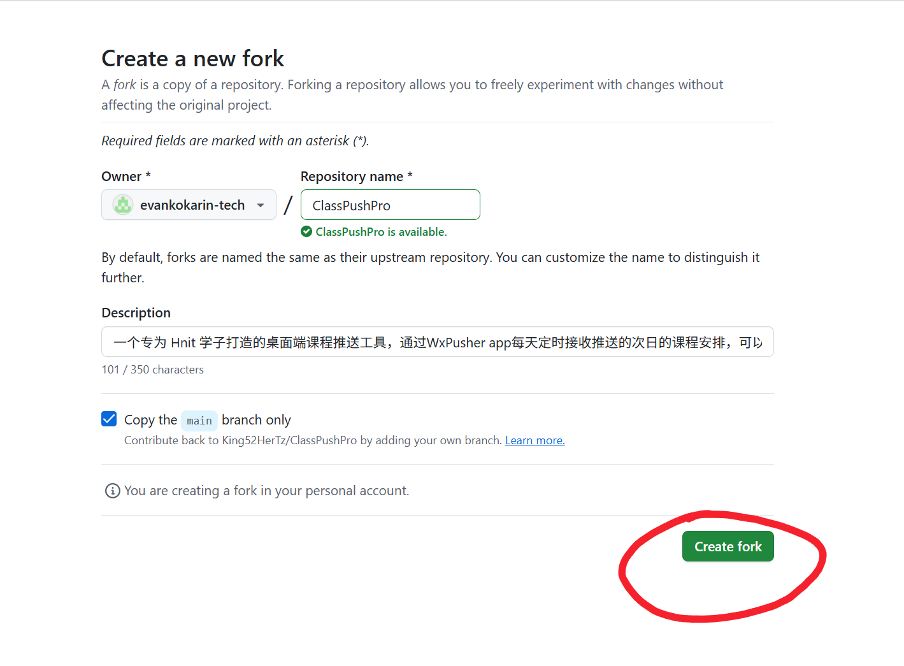

---

## 第二步：填写账号密码 (Secrets)

GitHub 非常安全，它提供了一个“保险箱”功能 (Secrets)，你的密码填进去后，连你自己都看不到明文，更别说别人了。

1.  进入你刚刚 Fork 后的仓库页面。
2.  点击顶部的 **Settings** (设置) 选项卡。
    > 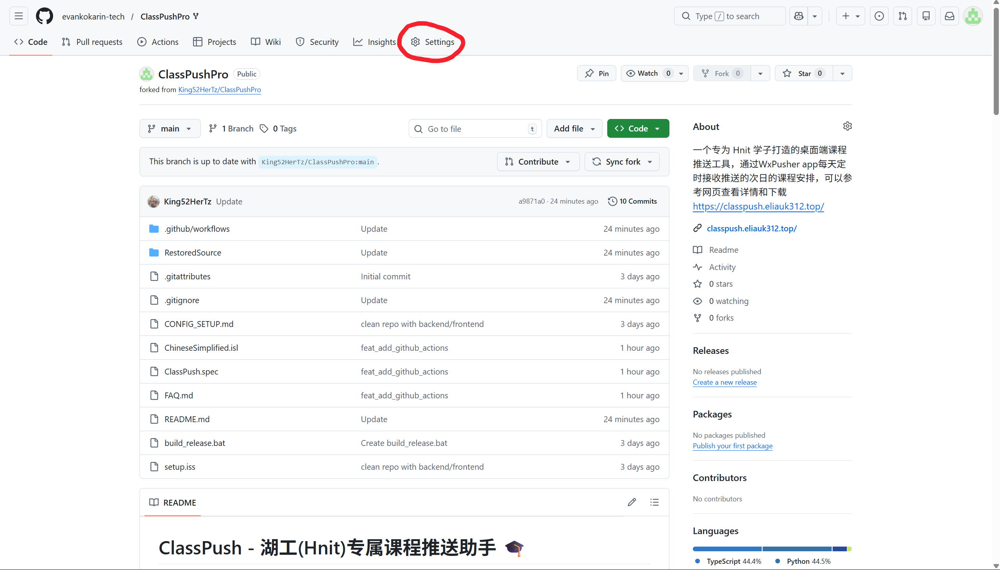

3.  在左侧菜单栏，点击 **Secrets and variables** (机密和变量) -> **Actions**。
    > 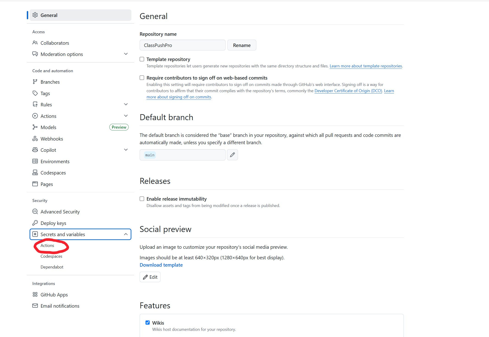

4.  点击右上角的绿色按钮 **New repository secret** (新建仓库机密)。
    > 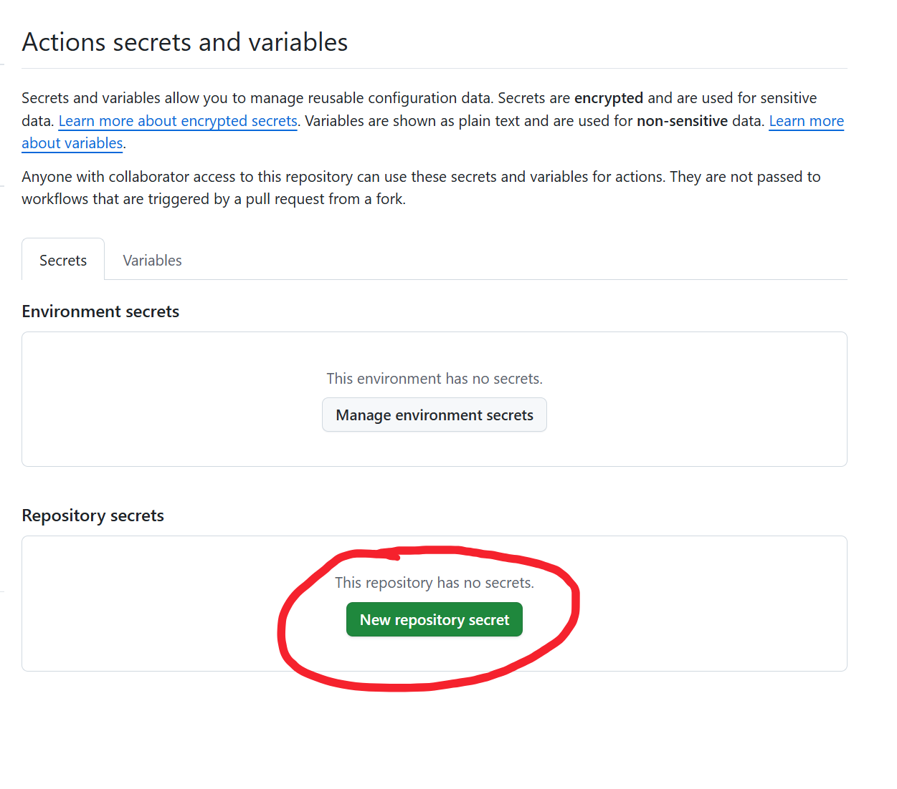

你需要重复添加以下 4 个变量 (注意名字要一模一样，全大写)：

| Name (变量名) | Secret (值) | 说明 |
| :--- | :--- | :--- |
| `CP_USERNAME` | `20210001` | 你的教务系统学号 |
| `CP_PASSWORD` | `123456` | 你的教务系统密码 |
| `CP_APP_TOKEN` | `AT_xxxxxx` | 你的 WxPusher AppToken (需要你自己申请，见下方说明) |
| `CP_UID` | `UID_xxxxxx` | 你的 WxPusher UID (见下方说明) |

> **提示**：一定要填对，如果密码错了，后面运行会失败哦。
> 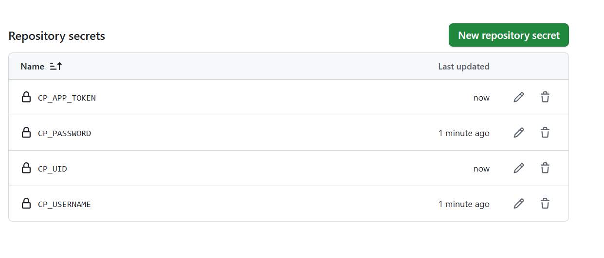

### 如何获取 AppToken 和 UID？

这是最重要的推送凭证！请按照以下步骤获取：

1.  **注册应用 (获取 AppToken)**：
    *   访问 [WxPusher 官网](https://wxpusher.zjiecode.com/admin/) 并登录。
    *   点击左侧“应用管理” -> “创建应用”。
    *   应用名称随便填（例如：`我的课表`），其他随便填，点击创建。
    *   在弹出的窗口中，你会看到 `AppToken`，**立刻复制它**并填入上面的 `CP_APP_TOKEN` 中。（注意：AppToken 只显示一次，忘了就要重置）

2.  **关注应用 (获取 UID)**：
    *   在应用列表页，找到你刚才创建的应用，点击“查看”。
    *   找到 **“关注二维码”**，用微信扫码关注 **你自己创建的应用**。
    *   关注后，点击微信里收到的“用户UID”消息，或者在后台“用户列表”里查看。
    *   复制你的 `UID_` 开头的字符串，填入上面的 `CP_UID` 中。

---

## 第三步：开启自动推送 (Enable)

为了防止打扰，我们默认提供了两个版本的推送时间，你可以自由选择开启哪一个（或者都开启）。

1.  点击顶部的 **Actions** 选项卡。
    > 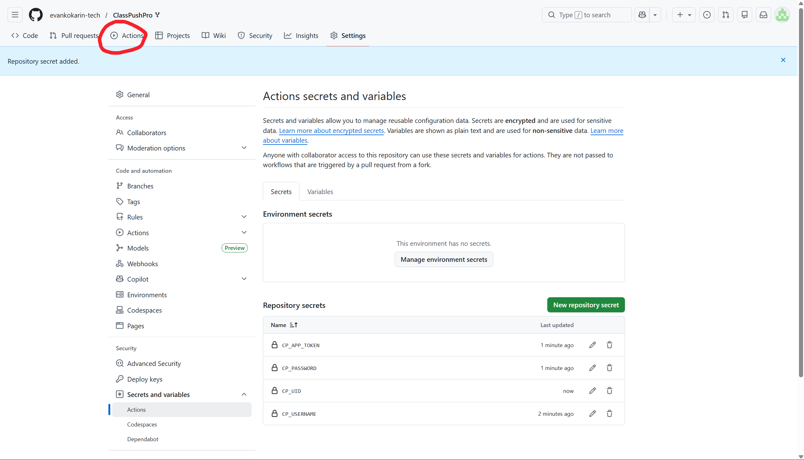

2.  点击绿色按钮 **I understand my workflows, go ahead and enable them** (如果出现的话)。
    > 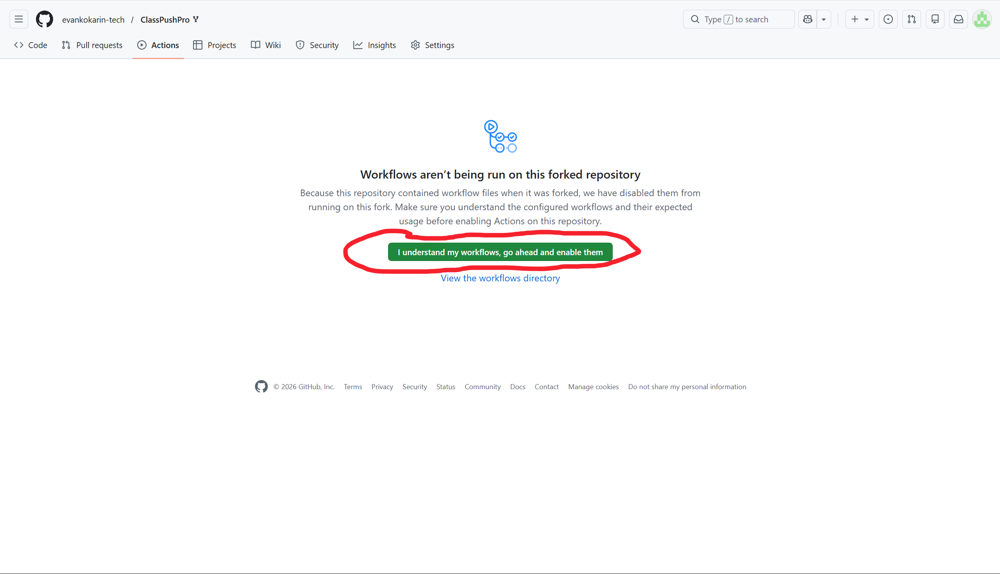

### 选择你的作息时间：

在左侧列表中，你会看到：
> 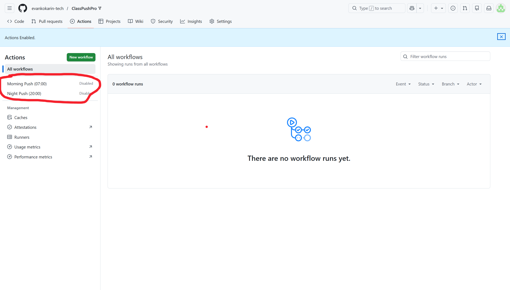

*   **Morning Push (07:00)**: 每天早上 7 点推送 **今天** 的课表。
*   **Night Push (20:00)**: 每天晚上 8 点推送 **明天** 的课表。

### 如何开启/关闭？

假设你想开启“晚安版”：
1.  点击左侧的 **Night Push (20:00)**。
2.  如果看到黄色提示 "This workflow has a workflow_dispatch event trigger..."，说明它已经准备好了。
3.  如果你想**禁用**某个版本（比如不想晚上收到推送）：
    *   点击它 -> 点击右上角的 **...** (三个点) -> **Disable workflow**。

### 手动测试一次

设置好后，建议先手动测试一下是否成功：
1.  点击左侧任一 Workflow (例如 **Night Push**)。
2.  点击右侧灰色的 **Run workflow** 按钮 -> 再点绿色的 **Run workflow**。
    > 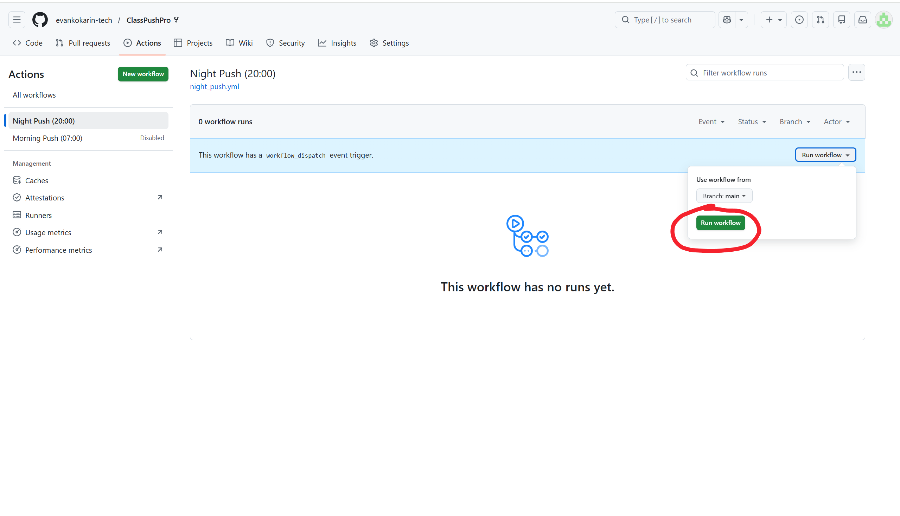

3.  等待 10-30 秒，刷新页面。
    *   ✅ **绿色对勾**：成功！看手机WxPusher app推送的消息！
    *   ❌ **红色叉号**：失败。可能是账号密码填错了，请回到第二步检查 Secrets。
    > 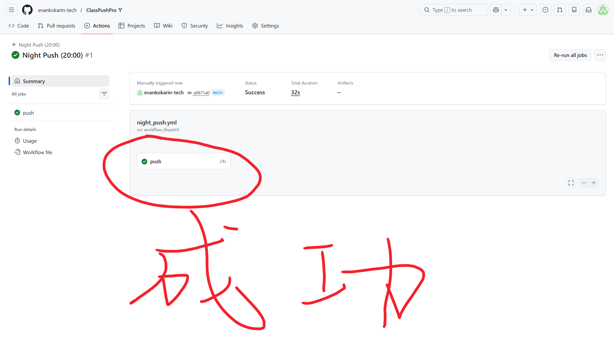

---

🎉 **大功告成！**
以后每天到了设定的时间，GitHub 就会自动给你发课表啦。哪怕电脑关机、手机没电，它都会准时送达。
